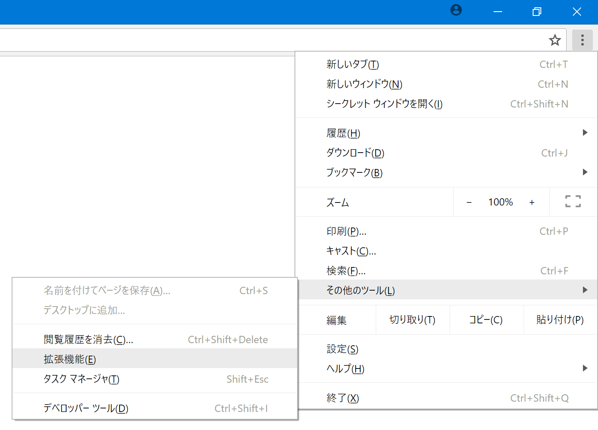
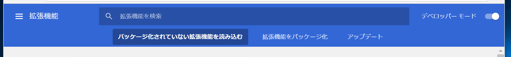
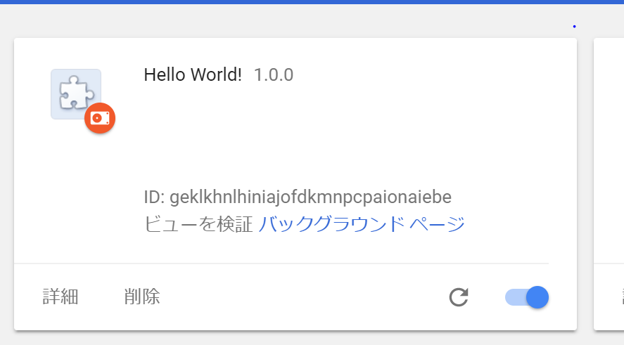
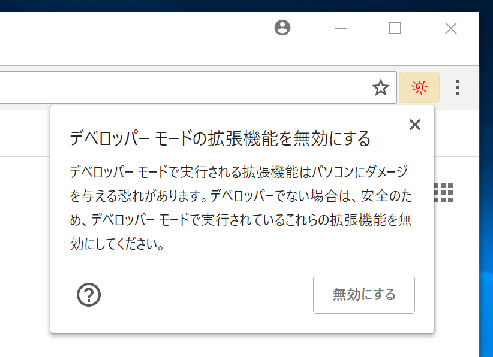

# Chromeで自作のブラウザー拡張を開発

[[toc]]

## インストール

1. メニュー（ウィンドウ右上の三つの点） → その他のツール → 拡張機能
::: figure

:::
2. 右上「デベロッパーモード」をオンにし、「パッケージ化されていない拡張機能を読み込む」
::: figure

:::
3.  `manifest.json` があるディレクトリーを選択
4. 一覧にカードが追加される
::: figure

:::

その後一覧に表示されるカードから以下の操作が可能です

- [再読み込み](#再読み込み（更新）)
- [削除](#アンインストール)
- [無効化](#無効化)
- バックグラウンドスクリプト用開発者ツールを開く

### 次回ブラウザー起動時

開発用に読み込んだ拡張機能は、次回ブラウザー起動時にも有効ですが、警告が表示されます。

::: figure

:::

## アンインストール

カードの「削除」ボタンから行います。

::: figure

:::

## 再読み込み（更新）

カードの更新ボタンから行います。くるっとしたアイコンのもの。

::: figure

:::

## 無効化

右下のスイッチから、一時的に有効化、無効化することもできます。

::: figure

:::
