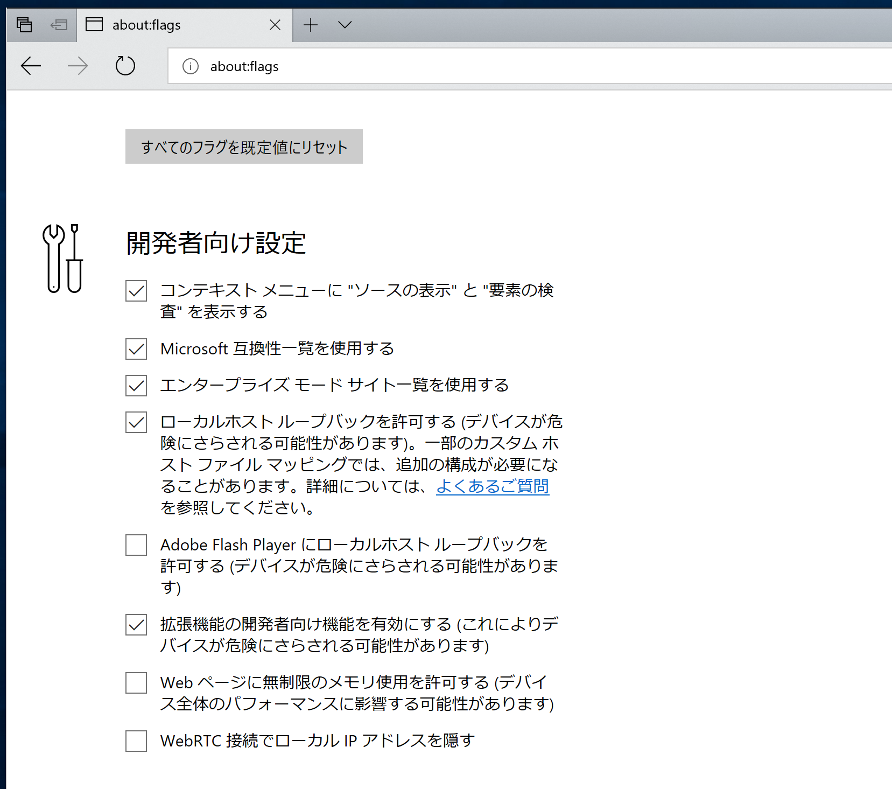
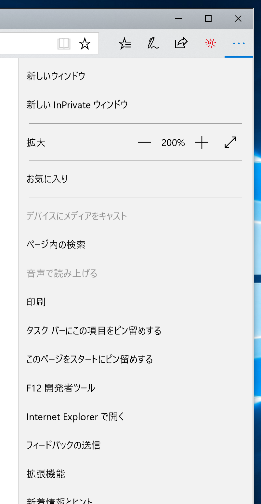
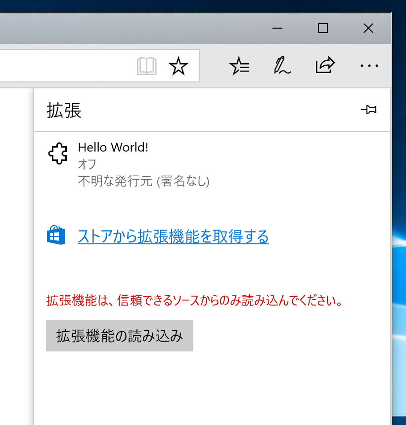
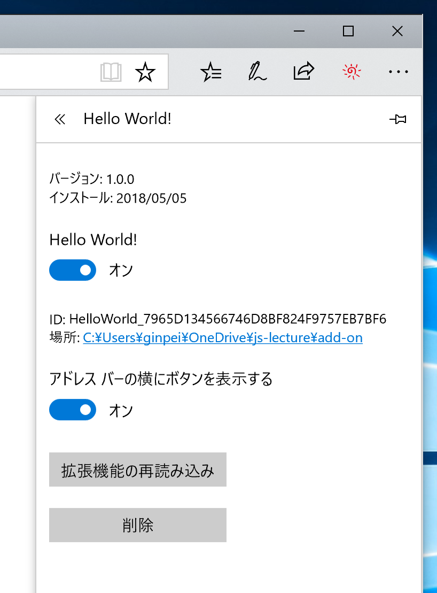

# Edgeで自作のブラウザー拡張を開発

## インストール

1. `about:flags` を開く（アドレスバーに入力）
2. 開発者向け設定の「拡張機能の開発者向け機能を有効にする（これにより…）」をオンに
    ::: figure
    
    :::
3. メニュー（ウィンドウ右上の三つの点） → 拡張機能
    ::: figure
    
    :::
4. 「拡張機能の読み込み」 `manifest.json` があるディレクトリーを選択
    ::: figure
    
    :::
5. 一覧に追加される
    ::: figure 一覧から詳細を開いた後の画面
    
    :::

その後一覧から詳細を開いて以下の操作が可能です。

- 再読み込み
- 削除
- 無効化
- バックグラウンドスクリプト用開発者ツールを開く

### 次回ブラウザー起動時

開発用に読み込んだ拡張機能は、次回ブラウザー起動時に警告が表示され、明示的に有効化するまで停止されます。